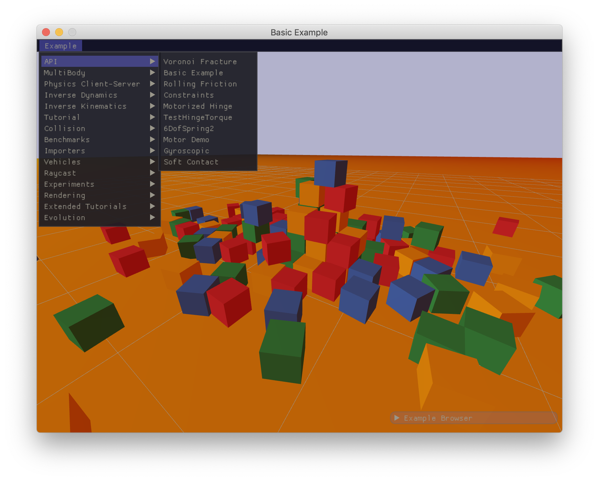
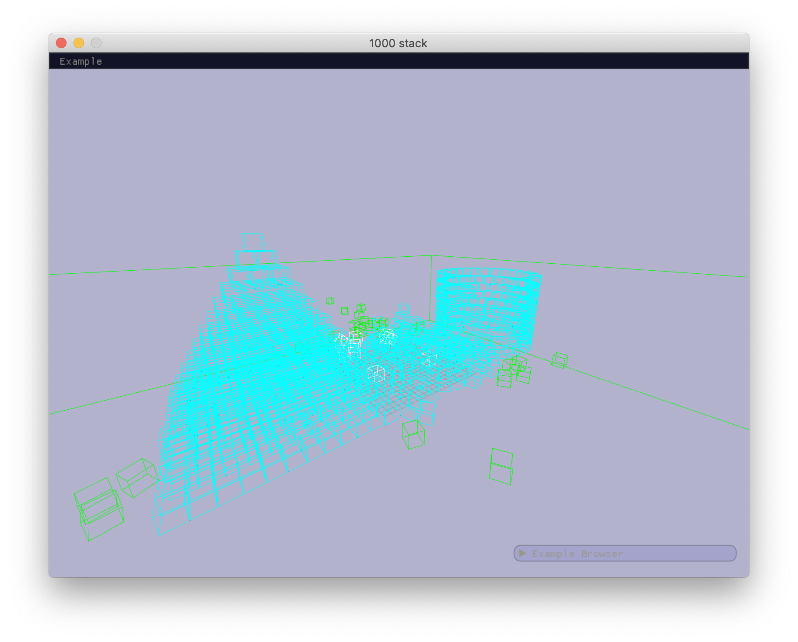

#  Readme

This repository contains the [Framework](https://github.com/marcel303/framework) integration for the [Bullet3](https://github.com/bulletphysics/bullet3) library. Bullet is a real-time physicsical simulation and collision detection library. It's used in robotics, games, and other creative ventures.



This repository contains,

- `chibi` files to make available the `bullet3` libraries,
- Framework implementations for Bullet's `app`, `render`, `debug draw` and `GUI helper` interfaces,
- Bullet's example browser, ported over to Framework.

## Getting up and running

In summary,

- Clone this repository,
- Clone a stable `bullet3` release,
- Clone the `framework` repository. `framework` is a library for creative coding, and includes the graphics API we depend on and the project file generator we will use,
- Create a 'chibi root' file, and let it point to both the 'framework' repository and this repository,
- Generate the project file.

Step by step:

```
cd ~
git clone https://github.com/marcel303/framework
git clone https://github.com/marcel303/bullet3-framework
git clone https://github.com/bulletphysics/bullet3.git --branch 2.89
```

Create a text file named `chibi-root.txt` with the following contents,

```
cd ~
vim chibi-root.txt
```

```
add_root framework
add bullet3-framework
```

This will create a chibi root file referencing the chibi files in both the `framework` and `bullet3-framework` repositories.

Generate the project file,

On linux/macOS,

```
cd ~
cd framework
./generate.sh bullet3*
```

On Windows,

```
cd framework
generate.bat bullet3*
```

Note that the wildcard `*` means we will generate all of the libraries and apps with a name starting with `bullet3`. This includes the bullet3 library, as well as some extension libraries and the Example Browser app ported over to Framework.

The project file generator should open Finder on macOS, with `Project.xcodeproj` focused, or Explorer on Windows, with `Project.sln` focused.

Open the generated project file in your favourite ide. To run Bullet's example browser, select the 'bullet3-exampleBrowser-framework' target and build and run it.

## Using bullet3-framework within your own projects
To use `bullet3-framework` within your own apps, you will need to,

- Create a folder and a `chibi.txt` file for your app(s),
- Add your chibi file to the chibi root,
- Add one or more apps to your chibi file, and depend on the bullet3 libraries,
- Generate the project file.

Step by step:

Create a folder and a `chibi.txt` file,

```
cd ~
mkdir myapp
```

Create a `chibi.txt` file within the `myapp` folder with the following contents,

```
cd myapp
vim chibi.txt
```

```
app myapp
	depend_library bullet3
	depend_library bullet3-framework
	add_files main.cpp
```

Create a `main.cpp` file,

```
#include "framework.h"
#include "SimpleFrameworkApp.h"

int main(int argc, char * argv[])
{
	setupPaths(CHIBI_RESOURCE_PATHS);
	
	auto * app = new SimpleFrameworkApp("Example Browser", 800, 600);

	while (!app->m_window->requestedExit())
	{
		app->m_renderer->init();
		app->m_renderer->updateCamera(app->getUpAxis());
		
		app->drawText3D("Hello World", 0.f, 0.f, 0.f, 1.f);

		app->swapBuffer();
	}

	delete app;
}
```

Add your chibi file to `chibi-root.txt`,

```
cd ~
vim chibi-root.txt
```

```
add_root framework
add bullet3-framework
add myapp
```

Generate the project file,

```
cd ~
cd framework
./generate.sh myapp
```

Note that the target to generate the project file for has changed to `myapp`. This will generate a project file tailored to build and run `myapp` only. If you want to add more targets to your project file, that's possible too. Just append the targets you want to generate to the command line.

For instance,

```
./generate.sh myapp bullet3*
```

## Using just bullet3

If you want to make an app that just uses bullet3 (rather than the framework integration that comes with this repo), just use,

```
depend_library bullet3
```

Inside your chibi file. Note you won't have access to any of the framework integrations, including the SimpleFrameworkApp used above or the Framework debug draw implementation.

## Debug draw using bullet3-framework

To use the framework debug drawer, make sure to depend on the `bullet3-framework` library, and include similar lines to the code below,

```
#include "FrameworkDebugDrawer.h"
#include "LinearMath/btIDebugDraw.h"

btIDebugDraw * debugDraw = nullptr;

void init()
{
	debugDraw = new FrameworkDebugDrawer();
	debugDraw->setDebugMode(
		btIDebugDraw::DBG_DrawWireframe |
		btIDebugDraw::DBG_DrawAabb);
		
	btDiscreteDynamicsWorld * rbWorld = ...;
	rbWorld->setDebugDrawer(debugDraw);
}

void draw()
{
	btDiscreteDynamicsWorld * rbWorld = ...;
	rbWorld->debugDrawWorld();
	
	debugDraw->flushLines();
}
```

Please refer to the Bullet3 documentation for more information about debug draw and its api.



## Scene render using bullet3-framework

todo : refer to framework example browser for an example
